# Compilador/Traductor por **Gustavo Padilla V.**
Proyecto de Seminario de Solución de Traductores de Lenguaje 2, Analizador léxico, sintáctico, semántico, generación intermedia y MASM compiler.

## Instrucciones para uso de traductor
- Instalar Python 3.6+
- Instalar easygui en python (pip install easygui)
- Ejecutar ./Traductor/traductor.py

### Traductor.py
Se encarga de ser la interfaz principal en consola, aquí se mandarán a llamar los métodos para todo el análisis y la generación de código. Este abre los archivo y los lee, y comienza el análisis pasándole la información al analizador léxico, también lee el archivo LR para posteriormente mandarle la información al analizador sintáctico. Además, aquí se muestra toda la información de los análisis y el código ASM al final.

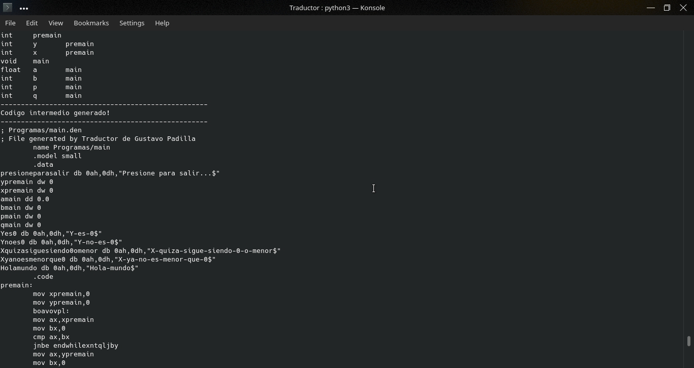

### Lexico.py
Es una clase el cual recibirá una cadena que será todo el programa a leer, y además tendrá un índice, y estado. Este será un automata que entrara en un bucle mientras haya caracteres que leer en la cadena recibida, posteriormente leerá el carácter y dependiendo de que carácter sea, cambiara la variable de estado a otro número, le asignara su token, lexema y tipo, y creara su valor con la clase Valor y lo cambiara al estado 20, el cual saldrá del while y así se agregara a una lista de Valores, iniciando otra vez con él automata reiniciando su estado a 0. Algo bastante similar se realiza con los lexemas como (&&) donde cuando se encuentra uno, se verifica que el siguiente sea correcto. En el caso de que sean caracteres alfa-numéricos o un guion (-), o se leerá completamente hasta que se encuentre otro carácter y se añadirá como su token un ID, posteriormente se recorrerá la lista buscando todos los de token ID para comparar si es una palabra reservada o un tipo de dato.

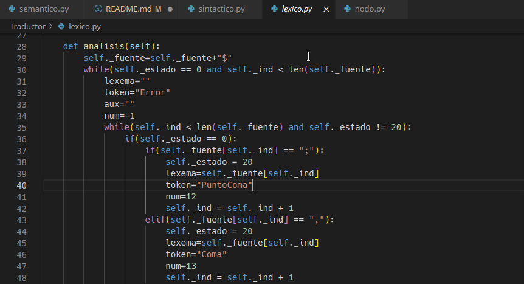

### Valor.py
Esta será la clase que guarde un valor, su token, lexema y tipo, tendrá sus seters y geters y se podrá generar una cadena de él.

### Sintactico.py
Esta clase se encarga primero de cargar todas las reglas en una lista de reglas al leer el archivo y llenar la tabla LR para el posterior análisis.

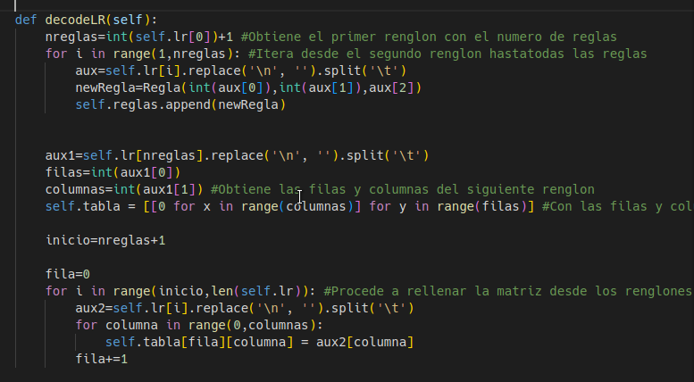

El algoritmo del análisis es muy simple, tiene un modo y una lista que simula ser un árbol, entra a un while infinito donde se obtiene el elemento de la pila de, que inicialmente tendrá un Valor auxiliar con tipo 0, el tipo será el entero con el que el algoritmo verifique el análisis, también dependiendo del modo se obtendrá el primer elemento de la lista de valores obtenido del léxico, si está en modo 1 que significara que lo último fue un desplazamiento, la fila será la pila y la columna el primero de la lista de léxico, en otro caso la fila será el penúltimo de la pila y la columna el último de la pila, de esta manera, con la matriz cargada se obtiene el número con la fila y columna, si es positivo es un desplazamiento, y se apila el primero de la lista de léxico si está en modo 1, y en cualquier modo se apila el número actual.

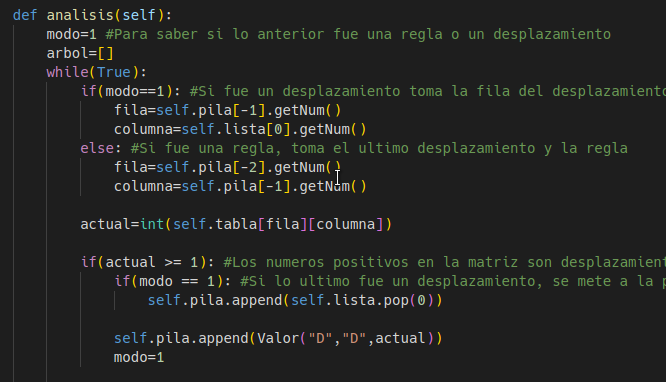

Si es negativo será una regla, se obtendrá su número real, la longitud multiplicada por dos para desapilar y el nombre, posteriormente se crea un nodo y se empiezan a desapilar los valores, si el token es diferente de R y D, al nodo se le añade a su lista de terminales el elemento desapilado. Luego verifica el número de la regla y con base en esto, toma el árbol, y desapila del árbol simulado y se los añade al nodo actual.

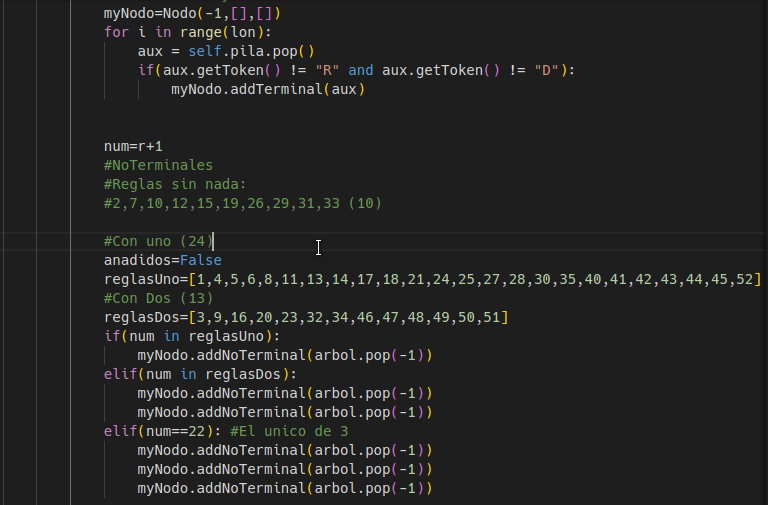

Para finalizar se le pone el número de la regla y se añade al nodo al árbol. Y regresa al árbol. 

### Regla.py
Esta clase solo contiene el ID de la regla, la longitud al momento de sacar elementos de la pila y el nombre de la regla.

### Nodo.py
Esta clase será para generar el árbol de los nodos de cada regla, tendrá una lista de no terminales, que será una lista de nodos, y una lista de terminales que será una lista de cadenas y el número de la regla actual del nodo, tendrá métodos para obtener la lista de terminales y no terminales, recorrerse, y añadir terminales, no terminales y la regla.

### Semantico.py
Esta clase recibe un nodo que será la raíz, este tendrá una función de analisis y preanalisis, la de analisis se manda a llamar en el traductor, y adentro del analisis se llama la función preanalisis, esta funcion se llamara recursivamente al recorrerse cada nodo, empezara desde la raíz y este va a leer la regla y con base en esta regla, ejecutara código para poder verificar todo error desde que una variable no esté declarada, ya lo esté, no sean del mismo tipo y contexto de declaración y al usarse.

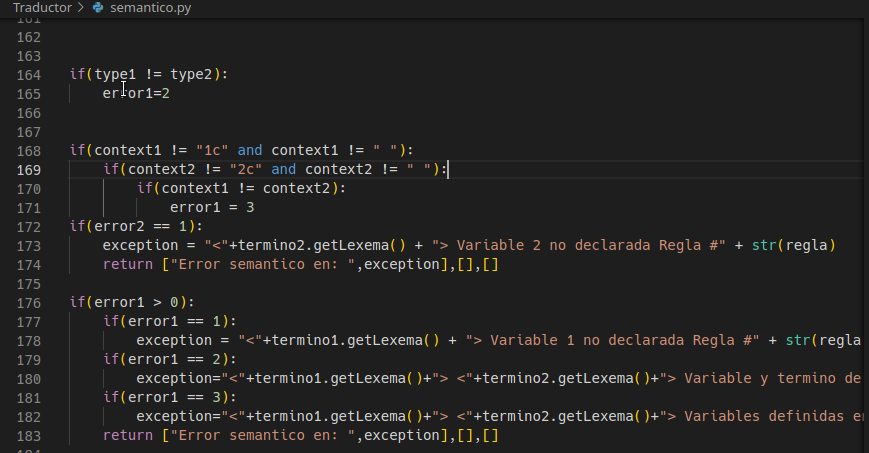 

 Para esto crea un Tabsim donde se irán guardando las declaraciones y su contexto, con base en esto varios métodos revisan los errores y a su vez se va generando el codigo intermedio en assembler, si es una suma hace add, si entra en un if o while hace cmp y jmp con base en que tipo son.

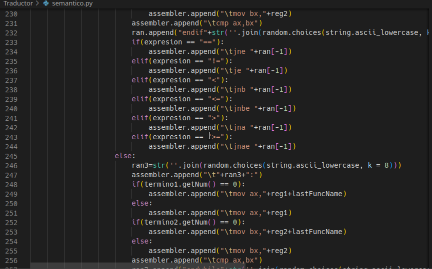

Al final regresa el Tabsim y el código generado en assembly como listas al traductor. 

## Instrucciones para uso de MASM compiler
- Copiar carpeta MASM dentro de la raiz de C:
- Añadir la variable de entorno a Path C:\MASM\BIN
- Ejecutar en cmd: ml [mi_archivo.asm]
- Correr .exe en un CPU de 32 bits
- O correr ASM en un simulador de 8086

### Ejemplo de main.den
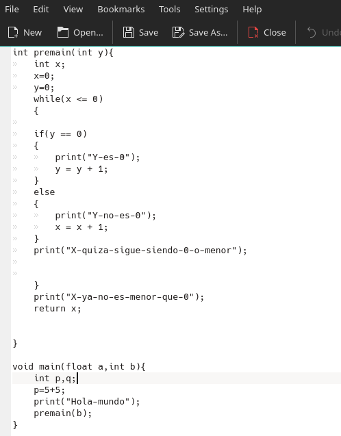
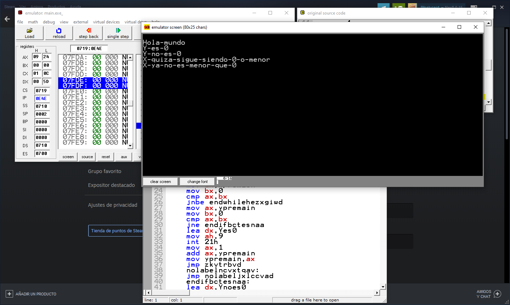
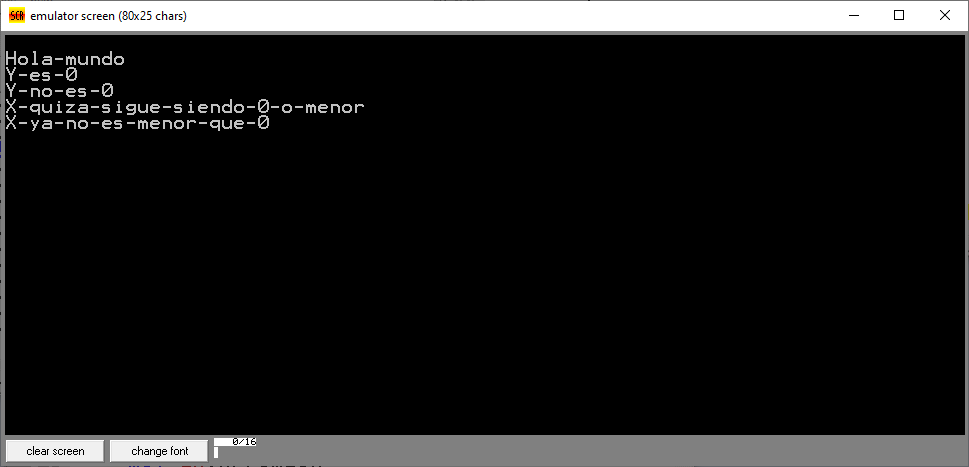

### Ejemplo de while.den
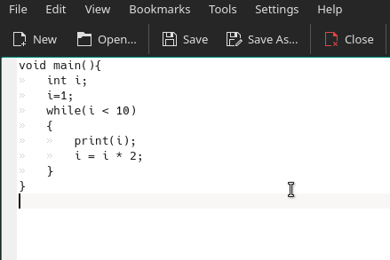
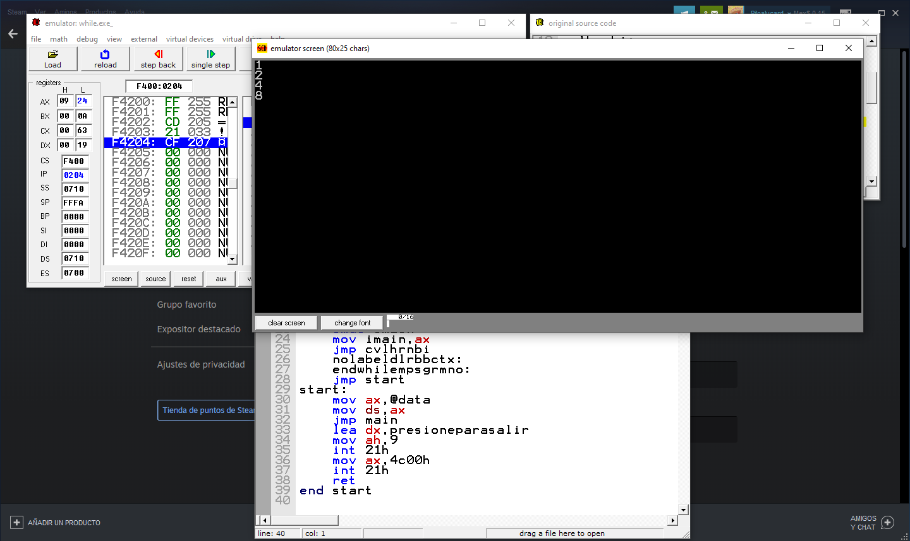

